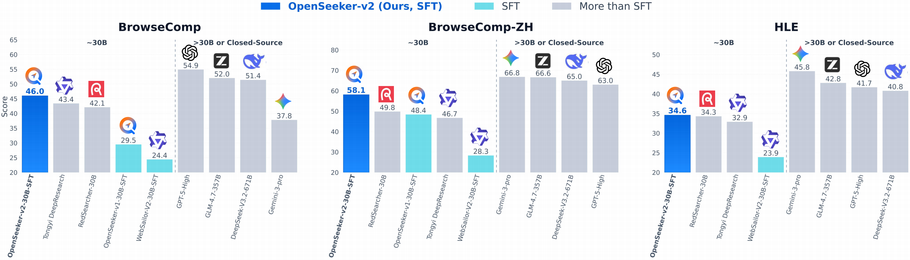

# OpenSeeker: Democratizing Frontier Search Agents by Fully Open-Sourcing Training Data

<div align="center">
  <a href="https://huggingface.co/papers/2603.15594">
    
  </a>
  <a href="https://arxiv.org/pdf/2605.04036">
    
  </a>
  <a href="https://huggingface.co/datasets/OpenSeeker/OpenSeeker-v1-Data">
    
  </a>
  <a href="https://huggingface.co/OpenSeeker/OpenSeeker-v1-30B-SFT">
    
  </a>
  <a href="https://huggingface.co/PolarSeeker/OpenSeeker-v2-30B-SFT">
    
  </a>
</div>

<div align="center">
  
</div>

<div align="center">
  
</div>

## 📰 News

- **2026.05.12** 🔥 We released the OpenSeeker-v2 code. See [Test OpenSeeker-v2](#test-openseeker-v2) for the model download, deployment, and evaluation commands.

- **2026.05.06** 📣 Our OpenSeeker-v2 achieves state-of-the-art performance across four benchmarks among 30B-scale ReAct-based search agents with simple SFT: **46.0%** on BrowseComp, **58.1%** on BrowseComp-ZH, **34.6%** on Humanity’s Last Exam, and **78.0%** on xbench, surpassing even Tongyi DeepResearch, which is trained with a heavy CPT+SFT+RL pipeline. The code is available in the [2026.05.12 update](#test-openseeker-v2).


- **2026.03.17** 🚀 We open-sourced OpenSeeker-v1 (all data and models). Using **11.7K** training examples, we fine-tuned Qwen3-30B-A3B-Thinking-2507 and achieved scores of **48.4%** on BrowseComp-ZH, **29.5%** on BrowseComp, **74.0%** on xbench-DeepSearch, and **59.4%** on WideSearch.

## Overview

OpenSeeker is an open-source search agent system that democratizes access to frontier search capabilities by fully open-sourcing its training data. This project enables researchers and developers to build, evaluate, and deploy advanced search agents for complex information-seeking tasks.


---
### 🌟 Key Achievement

> **OpenSeeker represents the first work by a purely academic team to achieve state-of-the-art performance on frontier search benchmarks while simultaneously open-sourcing the full training data.**
---

## Quick Start

### Installation

Clone the repository and set up the environment. This step is shared by OpenSeeker-v1 and OpenSeeker-v2.

```bash
# Clone repository
git clone https://github.com/rui-ye/OpenSeeker.git
cd OpenSeeker

# Create conda environment
conda create --name openseeker python=3.10
conda activate openseeker
pip install -r requirements.txt
```

### Test OpenSeeker-v1

Download and deploy the OpenSeeker-v1 model:

```bash
# 1. Install git-xet (required for downloading the model)
brew install git-xet
git xet install

# 2. Clone the OpenSeeker model repository
git clone https://huggingface.co/OpenSeeker/OpenSeeker-v1-30B-SFT

# 3. Set MODEL_PATH in run_openseeker.sh to the downloaded model directory
# Edit run_openseeker.sh and set MODEL_PATH="OpenSeeker-v1-30B-SFT"

# 4. Deploy the model server
bash run_openseeker.sh
```

Configure the search and evaluation APIs:

```bash
# Edit setup_env.sh with your API endpoints and keys
source setup_env.sh
```

Generate answers and evaluate results:

```bash
# Generate answers for your dataset
python3 eval/generate_answer.py \
    --dataset_path data/your_dataset.jsonl \
    --out_dir outputs/openseeker_v1 \
    --max_workers 100

# Evaluate the generated results
python3 eval/eval.py \
    --data_path outputs/openseeker_v1/result_tool200.jsonl \
    --max_workers 20
```

### Test OpenSeeker-v2

OpenSeeker-v2 uses the same installation, server script, environment configuration, and evaluation script as v1. The only changes are the model path and the answer-generation entrypoint.

```bash
# 1. Clone the OpenSeeker-v2 model repository
git clone https://huggingface.co/PolarSeeker/OpenSeeker-v2-30B-SFT

# 2. Set MODEL_PATH in run_openseeker.sh to the downloaded v2 model directory
# Example: MODEL_PATH="OpenSeeker-v2-30B-SFT"

# 3. Deploy the model server
bash run_openseeker.sh
```

Configure the search, visit, scorer, and E2B sandbox APIs:

```bash
# Edit setup_env.sh with your API endpoints and keys
source setup_env.sh
```

Generate answers with the v2 tool-augmented agent:

```bash
python3 eval/generate_answer_v2.py \
    --dataset_path data/your_dataset.jsonl \
    --out_dir outputs/openseeker_v2 \
    --max_workers 100
```

Evaluate the generated results with the same evaluator:

```bash
python3 eval/eval.py \
    --data_path outputs/openseeker_v2/result_tool200.jsonl \
    --max_workers 20
```


## Project Structure

```
OpenSeeker/
├── eval/                    # Evaluation scripts
│   ├── eval.py             # Main evaluation script
│   ├── generate_answer.py  # OpenSeeker-v1 answer generation script
│   ├── generate_answer_v2.py  # OpenSeeker-v2 answer generation script
│   └── prompt.py           # Prompt templates
├── src/                     # Core source code
│   ├── llm_tool_openseeker.py  # OpenSeeker-v1 LLM tool interface
│   ├── llm_tool_openseeker_v2.py  # OpenSeeker-v2 LLM tool interface
│   ├── config/             # Configuration files
│   │   └── chat_template.jinja  # Chat template configuration
│   └── tools/               # Tool implementations
│       ├── search.py       # Search tool
│       ├── visit.py        # Web visit tool
│       └── e2b_sandbox_tools.py  # E2B sandbox tools for OpenSeeker-v2
├── run_openseeker.sh       # Model server startup script
├── setup_env.sh            # Environment variable template
└── README.md               # This file
```

### 📚 Citation
If you find OpenSeeker useful in your research, please consider citing:

```bibtex
@article{du2026openseeker,
  title={OpenSeeker: Democratizing Frontier Search Agents by Fully Open-Sourcing Training Data},
  author={Du, Yuwen and Ye, Rui and Tang, Shuo and Zhu, Xinyu and Lu, Yijun and Cai, Yuzhu and Chen, Siheng},
  journal={arXiv preprint arXiv:2603.15594},
  year={2026}
}

@article{du2026openseekerv2,
  title={OpenSeeker-v2: Pushing the Limits of Search Agents with Informative and High-Difficulty Trajectories},
  author={Du, Yuwen and Ye, Rui and Tang, Shuo and Huang, Keduan and Zhu, Xinyu and Cai, Yuzhu and Chen, Siheng},
  journal={arXiv preprint arXiv:2605.04036},
  year={2026}
}
```

### ⭐ Star History

<a href="https://www.star-history.com/?repos=rui-ye%2FOpenSeeker&type=date&legend=top-left">
 <picture>
   <source media="(prefers-color-scheme: dark)" srcset="https://api.star-history.com/image?repos=rui-ye/OpenSeeker&type=date&theme=dark&legend=top-left" />
   <source media="(prefers-color-scheme: light)" srcset="https://api.star-history.com/image?repos=rui-ye/OpenSeeker&type=date&legend=top-left" />
   
 </picture>
</a>
